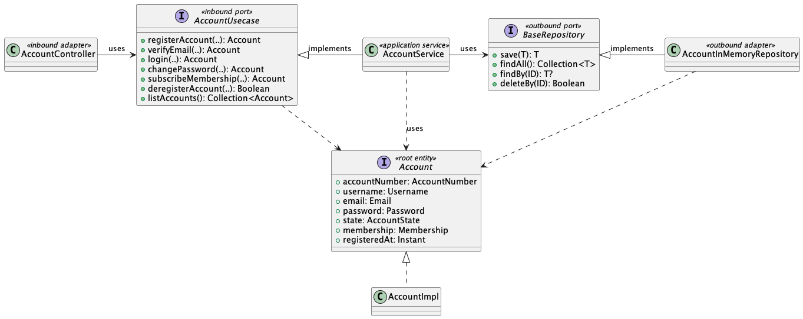

## Kotlin Dilemma

핵심 질문: 도메인(데이터) 모델을 interface로 선언했을 때의 이점이 무엇인가?

## About the Project



### Build & Run

Run main from IntelliJ

OR

```shell
./gradlew clean build
java -jar app/build/libs/app-all.jar
```


