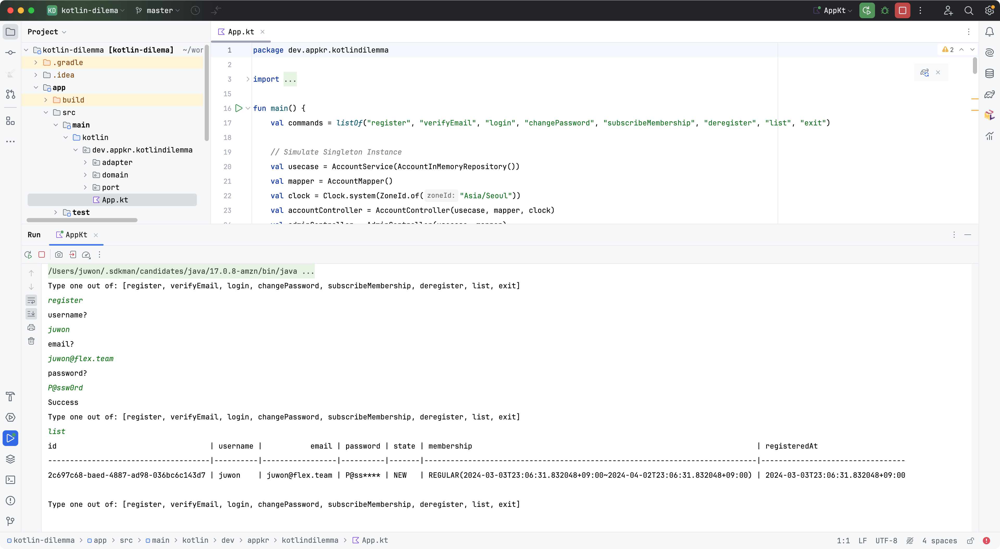

## Kotlin Dilemma

- Kotlin의 필드는 접근자(`getter`)와 변경자(`setter`) 기능을 내재한 `property`이다
- Kotlin `interface`엔 `field`(property)를 선언할 수 있다.
- Kotlin interface의 `field`는 public만 가능하고, `val` 키워드(불변, 읽기 전용)으로만 선언할 수 있다; 즉, 접근자만 노출된다

### 하고 싶은 것

- (1) 캡슐화, (2) 다형성, (3) 상속 등 객체 지향의 일반 특성을 모두 충족하고 싶다
- 데이터와 동작을 모두 포함하는 표현력이 풍부한 도메인 모델(엔티티 + 값객체)를 만들고 싶다
- Kotlin property의 접근자(getter) 기능을 쓰고 싶다
- Kotlin interface의 default method를 이용해서 하위 객체의 부담을 덜고 싶다

### 인터페이스를 상속한 구현 객체의 일례

- (3) 인터페이스 상속
    ```kotlin
    interface Account {
        val username: Username
        val password: Password
    }
    
    class AccountImpl(
        override val username: Username,
        override val password: Password,
        // 컴파일 오류: Cannot weaken access privilege 'public' for 'password' in 'Account'
        // override private val password: Password,
    ) : Account
    ```

### Password 변경하는 유스케이스

- 읽기 전용(val)이므로 인터페이스에 상태를 변경하는 기본 구현(default method)을 제공하는 것이 불가하다
    ```kotlin
    class AccountService(
        private val repository: AccountRepository,
    ) {
        fun changePassword(username: String, password: String) {
            val account: Account // Account 객체를 구한다
            account.changePassword(password)
            repository.save(account)
        }
    }
    
    interface Account {
        val username: Username
        val password: Password
        
        fun changePassword(password: String) {
            this.password = PasswordImpl(password) // 불변이므로, 컴파일 오류
        }
    }
    ```

- interface에서 상태를 변경하는 기본 구현을 구현 클래스로 옮긴다
- 구현 클래스의 필드를 가변으로 바꾸고, 서비스 레이어에서 하위 캐스팅하여 문제를 해결한다 
- **상위 모델에 changePassword() 기능이 없으므로 구현 객체가 늘어나면 (2) 다형성을 충족할 수 없다**
- **password 필드에 대한 (1) 캡슐화가 깨진다**
    ```kotlin
    interface Account {
        val username: Username
        val password: Password
    }

    class AccountImpl(
        override val username: Username,
        override var password: Password,
    ) : Account {
        fun changePassword(password: String) {
            this.password = PasswordImpl(password)
        }
    }

    class AccountService(
        private val repository: AccountRepository,
    ) {
        fun changePassword(username: String, password: String) {
            val account: Account // Account 객체를 구한다
            // ANTI-PATTERN: 하위 캐스팅
            (account as AccountImpl).password = PasswordImpl(password)
  
            repository.save(updated)
        }
    }
    ```

- 불변 속성을 존중하고, 하위 캐스팅하여 문제를 해결한다
- **[Anemic Domain Model](https://en.wikipedia.org/wiki/Anemic_domain_model), Thin Model-Fat Service, [Transaction Script](https://martinfowler.com/eaaCatalog/transactionScript.html) 스타일의 코드 양산할 가능성이 크다**
- **이런 스타일의 코드는 복잡성을 정복하기 어렵다**
    ```kotlin 
    interface Account {
        val username: Username
        val password: Password
    }

    class AccountImpl(
        override val username: Username,
        override val password: Password,
    ) : Account

    class AccountService(
        private val repository: AccountRepository,
    ) {
        fun changePassword(username: String, password: String) {
            val account: Account // Account 객체를 구한다
            // 보일러플레이트 코드를 많이 써야 하고, 자칫 맵핑 실수할 가능성도 있다
            val updated = AccountImpl(
                username = account.username,
                password = PasswordImpl(password)
            )     
            repository.save(updated)
        }
    }
    ```

- 가장 쉬운 방법, 인터페이스에 선언한 필드를 가변으로 바꾼다
- **(1) 캡슐화가 깨진다**
    ```kotlin 
    interface Account {
        val username: Username
        var password: Password
    }

    class AccountImpl(
        override val username: Username,
        override var password: Password,
        // 컴파일 오류: Cannot weaken access privilege 'public' for 'password' in 'Account' 
        // override internal var password: Password,
    ) : Account

    class AccountService(
        private val repository: AccountRepository,
    ) {
        fun changePassword(username: String, password: String) {
            val account: Account // Account 객체를 구한다
            account.password = PasswordImpl(password)
            repository.save(account)
        }
    }
    ```

- Kotlin 언어 설계자의 의도로 추정되는 구현은? -> **인터페이스가 구현을 알아야 하는 문제가 생긴다**
    ```kotlin 
    interface Account {
        val username: Username
        val password: Password

        fun changePassword(password: String): Account {
            return AccountImpl(
                username = username,
                password = PasswordImpl(password),
            )
        }
    }

    class AccountImpl(
        override val username: Username,
        override val password: Password,
    ) : Account

    class AccountService(
        private val repository: AccountRepository,
    ) {
        fun changePassword(username: String, password: String) {
            val account: Account // Account 객체를 구한다
            val updated = account.changePassword(password)
            repository.save(updated)
        }
    }
    ```

---

### 더 삽질해볼 것

1. Backing field
    ```kotlin
    // Not Tested
    interface Account {
        val username: Username
        val password: Password

        fun changePassword(password: String) // 빈 구현을 제공할 것인가?
    }

    class AccountImpl(
        private var _username: Username,
        private var _password: Password,
    ) : Account {
        override val username: Username
            get() = _username
        override val password: Password
            get() = _password
  
        override fun changePassword(password: String) {
            this._password = Password(password)
        }
    }

    // 값 객체는 불변이 더 어울린다
    data class Password(val value: String)  
    ```

2. Entity를 데이터 명세(getter/setter)를 선언한 interface로, 구현은 생성->변경->소멸의 수명을 갖는 클래스, Value(값 객체)는 no interface 불변 클래스로..
    - interface가 제공한 접근자는 그냥 쓴다
    - 변경자는 빈 구현을 제공한다 -> 구현 객체가 여러 개일때는 전부 유사한 로직을 구현해줘야 해서 부담이다
    ```kotlin
    // Not Tested
    interface Account {
        val username: Username
        val password: Password

        fun changePassword(password: String) {
            TODO("빈 구현을 제공한다")
        }
    }

    class AccountImpl(
        override val username: Username,
        override var password: Password,
    ) : Account {
        override fun changePassword(password: String) {
            this.password = Password(password)
        }
    }

    // 값 객체는 불변이 더 어울린다
    data class Password(val value: String)  
    ```

3. 모델은 interface를 만들지 않는 방법 -> 객체 외부에서 다른 객체로 맵핑할 때 접근자가 필요하다

    ```kotlin
    // Not Tested
    class Account(
        private var username: Username,
        private var password: Password,
    ) {
        fun changePassword(password: String) {
            this.password = Password(password)
        }
    }

    // 값 객체는 불변이 더 어울린다
    data class Password(val value: String)  
    ```

---

## 내가 이해하는 객체 지향

### 인터페이스의 기능

- 인터페이스(`inter` + `face`)는 명세(specification)이고 계약(contract)이다; '나는 이런 기능을 제공할 수 있는데, 너가 이런저런 요청을 하면, 내가 약속한 일을 하고, 여차저차한 결과를 줄게'라고 선언하는 것이다
- Program to an interface; 인터페이스가 바뀌지 않았다면, 호출이 깨지지 않을 것이며 일관된 결과를 제공할 것이라는예측을 할 수 있다

### 클래스의 기능

- 현실 세계의 복잡한 개념을 추상화한 개념 모델이다
- 객체 지향에서 클래스란 **(1) 데이터**와 **(2) 데이터를 사용하는 동작의 집합**를 의미한다; 데이터를 `field`/`variable`, 동작을 `method`/`operation`이라 한다
- 클래스를 실체화한 것을 객체(`object`)라 한다; 클래스라는 설계에 맞춰 찍어낸 인스턴스이며 시스템의 메모리에 실재한다; 생성 -> 변경 -> 소멸의 수명 주기를 갖는다

### 객체 지향

- **추상**(`abstraction`), **(1) 캡슐화**, **(2) 다형**, **(3) 상속** 등의 특성을 이용해 소프트웨어의 복잡성을 정복하기 위한 지혜이다
- 추상: 스타크래프트는 map, unit, building으로, unit은 다시 attackPower, defensePower, canFly, move(), attack(), .. 등으로 추상화할 수 있다
- (1) 캡슐화: 내부 구현을 드러내지 않고 인터페이스만으로 외부 세계와 소통한다
- (2) 다형성: 부모 객체를 기대하는 위치에 다양한 자식 객체가 전달되어 그 동작이 달라지는 특성
- (3) 상속: 앞서 언급한 다형성은 자식 객체가 부모 객체의 인터페이스를 상속/구현하기 때문에 가능하다; 물론 자식 객체만의 속성과 동작을 추가할 수 있다

---

## About the Project


### Build & Run

Run main from IntelliJ

OR

```shell
./gradlew clean build
java -jar app/build/libs/app-all.jar
```


